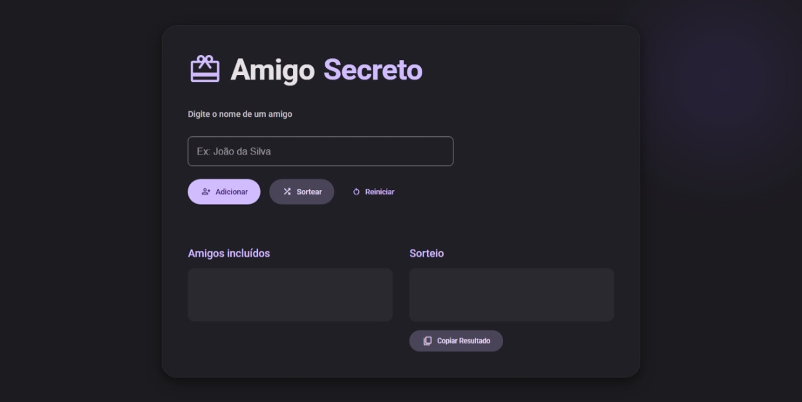

# Amigo Secreto - Projeto de sorteio

Este é um projeto de sorteio de amigo secreto desenvolvido em javascript. O objetivo é permitir que um grupo de pessoas possa sortear seus amigos secretos de maneira justa e aleatória.

Este projeto/exercício é fornecido pela Alura como parte do curso Lógica de Programação.

[Executar](https://joaopedro-chaves.github.io/amigo-secreto-Alura/)

## Funcionalidades

- Adicionar amigos
- Sortear amigos
- Copiar resultado
- Reiniciar sorteio
- Remover amigos

## Roadmap

| Adicões | Status |
| --- | --- |
| Mudar o visual para material design | Concluído |
| Adicionar botão de copiar resultado | Concluído |
